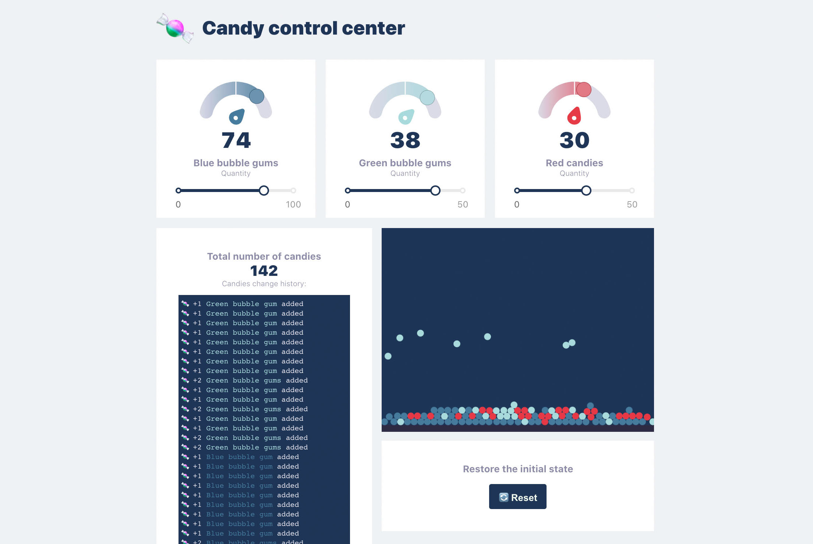

# Creating a Gauge in React

This fun Project started by me following the Tutorial [Creating a Gauge in React](https://wattenberger.com/blog/gauge) from Amelia Wattenberger

I then continued by building a small user interface around the created 'Gauge' components and created a few new components. In the user interface you can do some pretty pointless actions.



The project ended up being a small playground to experiment with some technologies:

* Typescript
* React hooks
* Redux
* Canvas / Matter.js
* SVG

## Run the project

The project uses create-react-app. Start the project by using `npm start`. 

---
**NOTE**

Currently there is a console warning:

```
Warning: findDOMNode is deprecated in StrictMode. findDOMNode was passed an instance of Handle which is inside StrictMode. Instead, add a ref directly to the element you want to reference. Learn more about using refs safely here: https://fb.me/react-strict-mode-find-node
```

There would be a fix for the rc-slider package, but it has not been merged yet due to compatibility issues:
[https://github.com/react-component/slider/issues/613](https://github.com/react-component/slider/issues/613)

---

